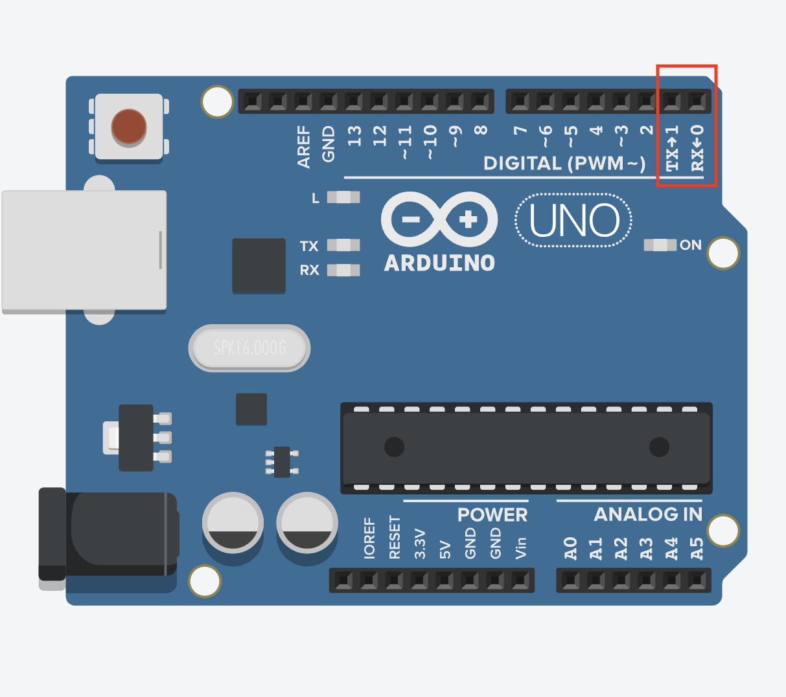

# Line_Tracer

## 프로젝트 개요
* 조도 센서와 초음파센서로 검은색 라인을 따라 이동하거나 장애물을 피하는 장치이다.
* 블루투스 모듈을 통해 안드로이드 어플로 원격 조작도 가능하다.
* arduino Uno 보드를 사용한다. 조도 센서는 TCRT5000모듈을 사용한다. 초음파센서는 HC-SR04를 사용한다.

## 블루투스 모듈의 아두이노 IDE 업로드 에러 처리
* 블루투스 모듈을 아두이노 보드와 연결된 상태에서 코드를 컴파일하고 업로드 시 에러가 발생한다.
* 아두이노 보드의 0번핀(RX)과 1번핀(TX)은 아두이노 IDE를 통해 작성한 프로그램을 업로드하여 사용하는 핀이다.
* 따라서 먼저 프로그램을 아두이노 우노 보드에 업로드하고 TX핀과 RX핀을 블루투스 모듈과 연결한다.

## 적외선 리모컨 컴파일 에러 처리
* Arduino 기본 라이브러리의 RobotIRremote와 어플리케이션으로 배포된 RobotIRremote와 달라서 에러가 발생한다.
1. 기존 RobotIRremote 폴더를 삭제한다.
	* 설치된 드라이브\Program Files (x86)\Arduino\libraries의 폴더에서 RobotIRremote 폴더를 삭제한다.
2. Arduino IDE를 실행한다.

3. Sketch -> Include Library -> Manage Libraries를 클릭하여 실행한다.

4. 실행된 Library Manager에서 IRremote를 검색하여 설치한다.(버전: 2.0.1)

