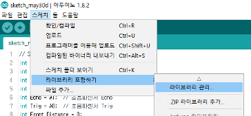
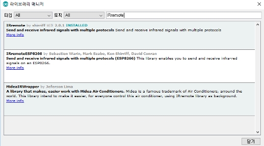

# Line_Tracer
arduino

## 적외선 리모컨 컴파일 에러
* Arduino 기본 라이브러리의 RobotIRremote와 어플리케이션으로 배포된 RobotIRremote와 달라서 오류가 발생한다.

## 적외선 리모컨 에러 처리
1. 기존 RobotIRremote 폴더를 삭제한다.
	* 설치된 드라이브\Program Files (x86)\Arduino\libraries의 폴더에서 RobotIRremote 폴더를 삭제한다.
2. Arduino IDE를 실행한다.
3. Sketch -> Include Library -> Manage Libraries를 클릭하여 실행한다.

4. 실행된 Library Manager에서 IRremote를 검색하여 설치한다.(버전: 2.0.1)

